# Homeless PIT Count Analysis
The purpose of this project is to analyze the growth of Homeless Population since 2007. Point-in-Time Count is a mandatory count of the homeless population nation wide. The goal of this project is to combine all the PIT Count datasets, analyze major trends and help create a better plan to tackle homelessness.

## Dataset
1. **Source**: 
[HUD Exchange](https://www.hudexchange.info/resource/3031/pit-and-hic-data-since-2007/)

2. **Years explored**: 
2007 - 2023

3. **Shape of the dataset**: 
- Shape of the datasets increased over the years.
- For e.g. the PIT Count 2007 dataset has 386 rows and *26 columns*, while the PIT Count 2023 has 389 rows and *646 columns*.

4. **Key Columns**

| Categorical | Numercial  | Timeframe |
|----------|----------|----------|
| CoC Name | Overall Homeless | Year |
| State_Territory | Overall Chronically Homeless |
| Count Types | Sheltered Total Homeless |
| CoC Number | Sheltered Total Chronically Homeless |

Detail the analytical methods and processes used in the project. This could include data cleaning steps, statistical methods, machine learning models, or visualization techniques.

## Methodology
The goal is to combine and clean the data without loosing a large number of rows.

#### Data Cleaning
1. Dealing with Null values in "Count Types" column.
  - "Count Types" column had 805 null values. In order to deal with them multiple strategies were used.
    - If a row had "Count Types" as null then take of column "CoC Name" and check its previous and next year's "Count Types" value. If they are the same then impute that same values in the null cell.
    - If the first condition is not true then check if either of the previous or next year value is equal to "Sheltered and Unsheltered Count", if so, then impute the null cell with this value.
    - If the second condition is also not met then check if either of the previous or next year value is equal to "Sheltered and Partial Unsheltered Count", if so, then impute the null cells with this value.
    - If the third condition is also not met then check if either of the previous or next year value is equal to "Sheltered-Only Count", if so, then impute the null cells with this value.
    
    P.S. These conditionalities took care of over half of the null values on "Count Types"
    - If null values still remained in the dataset for "Count Types" column then we imputed them with the mode of the corresponding "CoC Name" rows.
    
    P.S. This took care of over 99% of the remaining null values, leaving us with 5 null values in the column.
    - The remaining null values were imputed with the mode of the entire column.
   
#### Visualization Techniques

Goal: The original goal was to create a dataset for years 2017 - 2021.

Issue: These datasets did not give the full picture of the issue of homelessness.

Examples:

  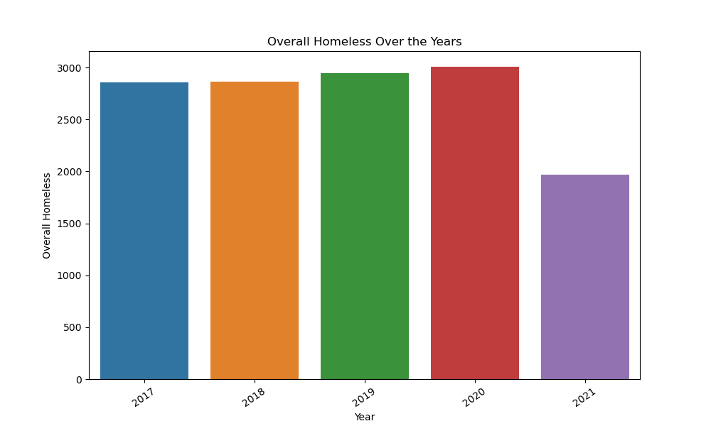
  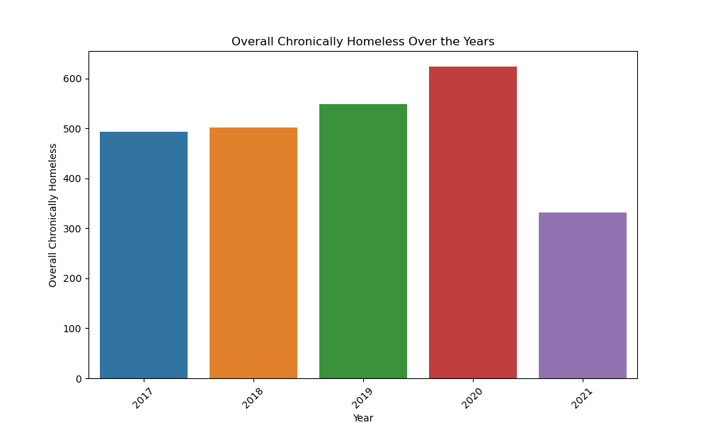

**Solution**: Combined all 17 datasets spanning from 2007 to 2023, resulting in a more clear picture of the cirsis of homelessness.

  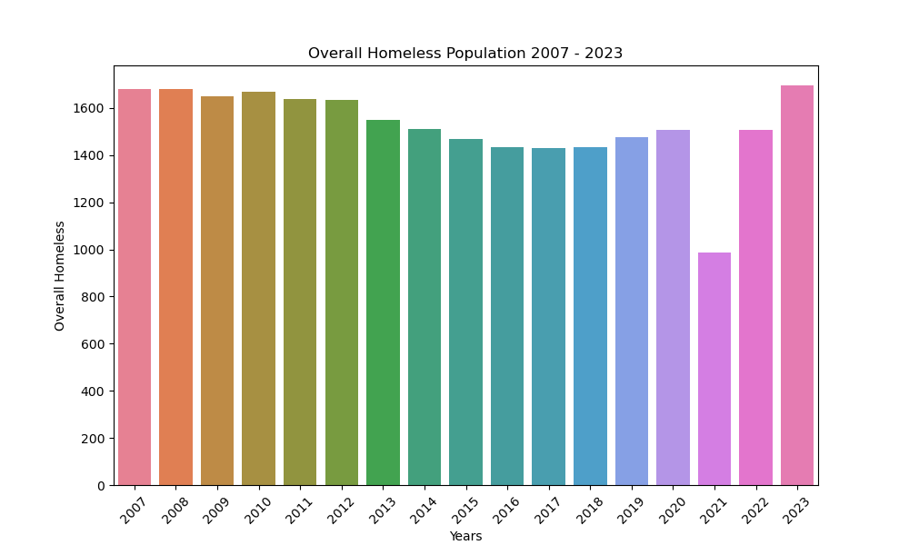
  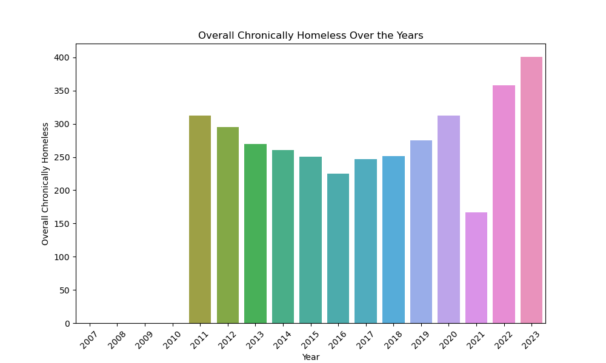

## Explanatory Analysis
- Uilized Tableau to created visualization showing:
  - The U.S. with homeless population per state from 2007 to 2023.
  - Explored the Population growth of Overall Homeless Population from 2007 to 2023 and how many were sheltered.
  - Explored the Population growth of Chornically Homeless from 2007 to 2023 and how many were sheltered.

Link to the Visualization: 
[PIT Count Analysis 2007 - 2023](https://public.tableau.com/app/profile/navnoor.kahlon/viz/PITCountAnalysis2007-2023/Story3)

## Specialized Datasets
The combined dataset provided an extensive look into the homeless population count. However, the dataset is also plagued with thousands of null values. These null values exist mainly because that specific column was not present in the prior year's dataset. However, the dataset is divided into sections. For example, the first column of a section would be "Overall Homeless" then the following 15 columns would explore different aspect of it such as the age group, race, gender and ethnicity. This finding brought the need to created specialized datasets that can be used for analysis and future model building.

### General Column Dataset
- This dataset consists of all the columns common among all the 17 dataset. Additionally, these common columns can also be considered the general categories under which more variables were created in the following years.
- Shate of the dataset: (6516, 28)
- The number of null values dropped drastically in this dataset with "Unsheltered Chronically Homeless Individuals" columns having the most at 39.
- This dataset was used for explanatory analysis on tableau.

### Chronically Homeless dataset
- This dataset specilizes in the Chronically Homeless population.
- As found in the exploratory analysis of the unified dataset the count for the Chronicaly Homeless population didn't start until 2011. So the dataset only contains datasets with year 2011 onwards.
- Share of the dataset: (4986, 21)
- The highest number of null values were in column Unsheltered Chronically Homeless People in Families at 44.
- This dataset was used for explanatory analysis on tableau. 

## SQL Exploration
### 1. Highest recorded homeless population
  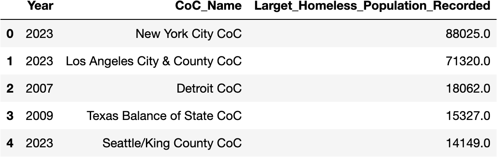

### 2. Highest & lowest percentage of sheltered homeless population
#### By State

  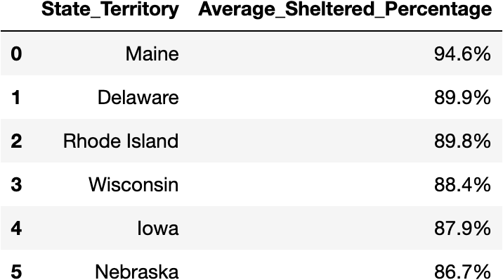
  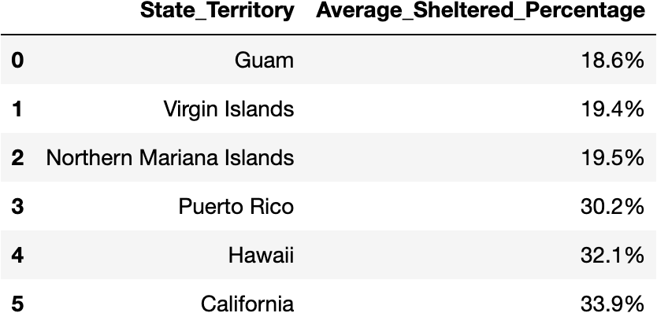

#### By Year

  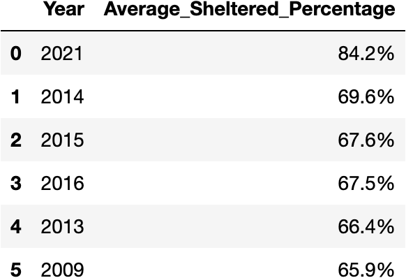
  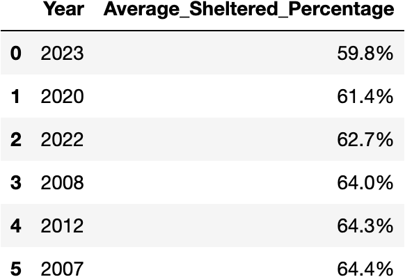

### Highest ratio of Chronically Homeless population to Overall Homeless population
#### By State - CoC - Year

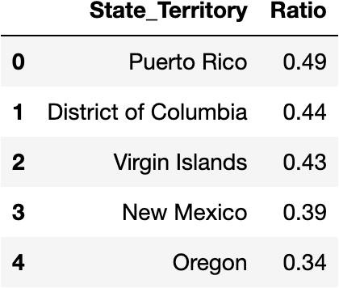
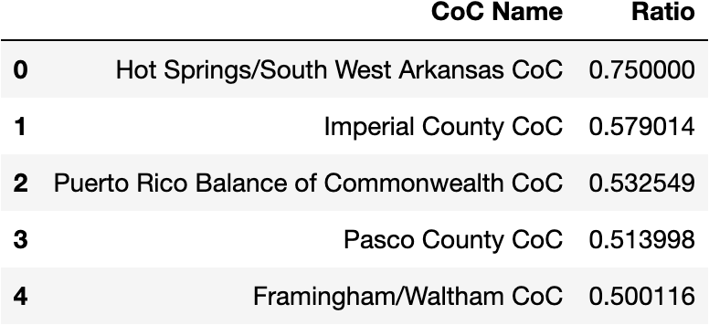
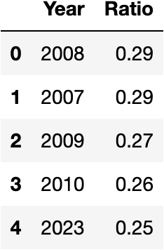

## Further ideas to explore
1. Retrieve the amount of money spent by every state every year on homelessness and compare it with the numlber of homeless population sheleted and how the growth or decline of the homeless population.
2. Create a Time Series model, per state, that can predict the following year's homeless population.

