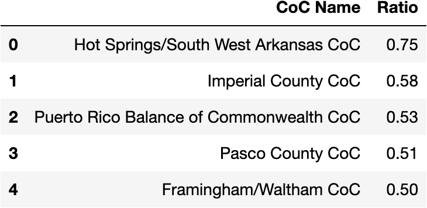

# Homeless PIT Count Analysis
Homelessness has become an increasingly large issue in American society. This project aims to analyze the growth of the homeless population from 2007 to 2023, using Point-in-Time (PIT) Count datasets provided by the U.S. Department of Housing and Urban Development (HUD). The PIT Count is a federally mandated survey that enumerates individuals and families experiencing homelessness across the country. The primary goals of this project are to merge these datasets, explore major trends in homelessness and the provision of shelters, and identify potential strategies to mitigate this pressing issue.

## Dataset
1. **Source**: 
[HUD Exchange](https://www.hudexchange.info/resource/3031/pit-and-hic-data-since-2007/)

2. **Years explored**: 
2007 - 2023

3. **Shape of the dataset**: 
- As the years have passed, the number of variables in the dataset has steadily increased.
- For example, the PIT Count 2007 dataset contains 386 rows and *26 columns*, while the PIT Count 2023 has 389 rows and *646 columns*.
- This increase in variables has has a net positive impact. It allows for more detailed analysis based on the population's age, race, gender and other demographic factors. This enhanced granularity aids in undersanding the diverse needs of the homeless population and developing tragetted interventions.

4. **Key Columns**

| Categorical | Numercial  | Timeframe |
|----------|----------|----------|
| CoC Name | Overall Homeless | Year |
| State_Territory | Overall Chronically Homeless |
| Count Types | Sheltered Total Homeless |
| CoC Number | Sheltered Total Chronically Homeless |

5. **Explaing the columns**
- CoC Name: CoC stands for Continuum of Care. A CoC is a regional or local planning body that is responsible for coordinating the funding of services provided to homeless families and individuals. A CoC can contain a region of a city, an entire city, a group of cities or even counties.
- CoC Number: It is a unique number assigned to every CoC.
- Count Types: This column refers to the different methods each CoC used to count the homeless population. Such as Sheltered & Unsheltered Count or Sheltered Only Count.

## Methodology
Goal: Merge and clean the datasets without loosing a significant number of rows.

#### Data Cleaning
1. **Dealing with Null values in "Count Types" column:**
   
  - Imputing null values in this variables is crucial for properly analyzing any relationships between the types of counts conducted and the outcomes.
  - The variable initially had 805 null values.
  - Employed a hierarchical imputation system based on the data's contextuality:

    a. If "Count Types" was null, first referenced the "CoC Name" to check the "Count Types" value in the previous and following years. If they matched, that value was imputed.

    b. If the values varied then the following values would be given preference in specified order:
      1. "Sheltered and Unsheltered Count"
      2. "Sheltered and Partial Unsheltered Count"
      3. "Sheltered-Only Count"

 - These steps resolved over half of the null values in "Count Types."
    
    c. If null values still remained, they were imputed using the mode of the "Count Types" for rows under the same "CoC Name."

 - This method addressed over 99% of the remaining nulls, leaving only five.
    
    d. The last few null values were impute with the mode of the entire "Count Types" column.

This systematic approach ensured data integrity and improved the robustness of our subsequent analyses.

   
#### Visualization Techniques

Goal: The original goal was to create a dataset for years 2017 - 2021.

Issue: These datasets did not give the full picture of the issue of homelessness.

Examples:

  
  

**Solution**: Combined all 17 datasets spanning from 2007 to 2023, resulting in a more clear picture of the cirsis of homelessness.

  
  

## Explanatory Analysis
- Uilized Tableau to created visualization showing:
  - The U.S. with homeless population per state from 2007 to 2023.
  - Explored the Population growth of Overall Homeless Population from 2007 to 2023 and how many were sheltered.
  - Explored the Population growth of Chornically Homeless from 2007 to 2023 and how many were sheltered.

Link to the Visualization: 
[PIT Count Analysis 2007 - 2023](https://public.tableau.com/app/profile/navnoor.kahlon/viz/PITCountAnalysis2007-2023/Story3)

## Specialized Datasets
The combined dataset provided an extensive look into the homeless population count. However, the dataset is also plagued with thousands of null values. These null values exist mainly because that specific column was not present in the prior year's dataset. However, the dataset is divided into sections. For example, the first column of a section would be "Overall Homeless" then the following 15 columns would explore different aspect of it such as the age group, race, gender and ethnicity. This finding brought the need to created specialized datasets that can be used for analysis and future model building.

### General Column Dataset
- This dataset consists of all the columns common among all the 17 dataset. Additionally, these common columns can also be considered the general categories under which more variables were created in the following years.
- Shate of the dataset: (6516, 28)
- The number of null values dropped drastically in this dataset with "Unsheltered Chronically Homeless Individuals" columns having the most at 39.
- This dataset was used for explanatory analysis on tableau.

### Chronically Homeless dataset
- This dataset specilizes in the Chronically Homeless population.
- As found in the exploratory analysis of the unified dataset the count for the Chronicaly Homeless population didn't start until 2011. So the dataset only contains datasets with year 2011 onwards.
- Share of the dataset: (4986, 21)
- The highest number of null values were in column Unsheltered Chronically Homeless People in Families at 44.
- This dataset was used for explanatory analysis on tableau. 

## SQL Exploration
### 1. Highest recorded homeless population
  

### 2. Highest & lowest percentage of sheltered homeless population
#### By State

  
  

#### By Year

  
  

### Highest ratio of Chronically Homeless population to Overall Homeless population
#### By State - CoC - Year

## Further ideas to explore
1. Retrieve the amount of money spent by every state every year on homelessness and compare it with the number of homeless population sheleted and how the growth or decline of the homeless population.
2. Create a Time Series model, per state, that can predict the following year's homeless population.

